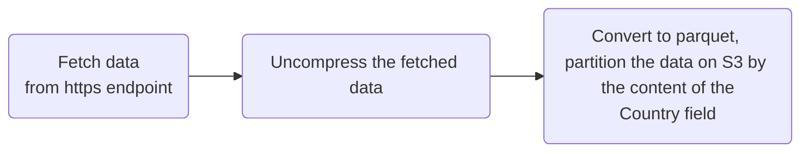

# iata-data-processing

## Process Flow

```mermaid
graph LR
A(Fetch data
from https endpoint) -->B(Uncompress the fetched data)
    B --> C(Convert to parquet, partition the data on S3 by the content of the
Country field)
```